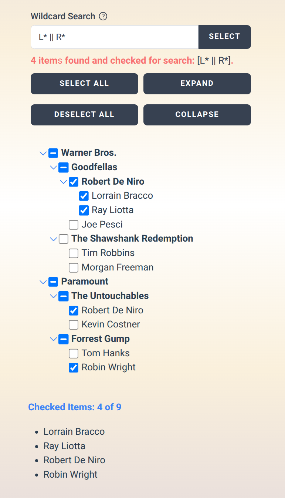

# HummingbirdTreeview.vue

A powerful and fast Vue.js treeview component.

#### [View CHANGES.md](https://github.com/hummingbird-dev/HummingbirdTreeview.vue/blob/master/CHANGES.md)

## Features

- Display hierarchical tree structures.
- Simple input data structure.
- Tri-state logic.
- Get checked items programmatically.
- ... and more

## Dependencies

- vue 
- (tailwindcss)
- (heroicons)

Sometimes it can be tricky to integrate a component into ones own
workflow. Therefore we ship all styles with the *HummingbirdTreeview.css* to be
independent from *tailwindcss* and *heroicons*. However, if you want
to change the style of the *HummingbirdTreeview* you have to integrate
it into your environment and do not use our *HummingbirdTreeview.css*.

## Installation

Install via npm

``` shell

$ npm install hummingbirdtreeview.vue

```

## Example 




## Project Setup

As a simple example to setup *HummingbirdTreeview* follow the
instructions at https://vuejs.org/guide/quick-start.html.

Then install *HummingbirdTreeview* via npm.

Next replace the *App.vue*:

``` shell
cp node_modules/hummingbirdtreeview.vue/App.vue src/App.vue

```

Copy the style file:

``` shell
cp node_modules/hummingbirdtreeview.vue/HummingbirdTreeview.css src/HummingbirdTreeview.css

```

Include the style file in *index.html*

``` html
<!DOCTYPE html>
<html lang="">
  <head>
    <meta charset="UTF-8">
    <link rel="icon" href="/favicon.ico">
    <meta name="viewport" content="width=device-width, initial-scale=1.0">
    <link rel="stylesheet" crossorigin href="/src/HummingbirdTreeview.css">

    <title>Vite App</title>
  </head>
  <body>
    <div id="app"></div>
    <script type="module" src="/src/main.js"></script>
  </body>
</html>

```

Finally run your project: *npm run dev* or *npm run build*.


## Input data

HummingbirdTreeview.vue makes it super easy to create deep hierarchical
trees. The key is to create a simple Javascript array of objects:

``` javascript
	 tree = [
	     {
		 "name": "Warner Bros.",
		 "collapsed": false,
		 "visible": true,
	     "checkbox": true,
         "checked" : false,
	     "value" : "",
         "tooltip" : "",
		 "filepath" : "",		 
	     },
	     {
		 "name": "-Goodfellas",
	     },
	     {
		 "name": "--Robert De Niro",
	     },
	     {
		 "name": "---Lorrain Bracco",
	     },
	     {
		 "name": "---Ray Liotta",
	     },
	     {
		 "name": "--Joe Pesci",
	     },
	     {
		 "name": "-The Shawshank Redemption",
	     },
	     {
		 "name": "--Tim Robbins",
	     },
	     {
		 "name": "--Morgan Freeman",
	     },
	     {
		 "name": "Paramount",
	     },
	     {
		 "name": "-The Untouchables",
	     },
	     {
		 "name": "--Robert De Niro",
	     },
	     {
		 "name": "--Kevin Costner",
	     },
	     {
		 "name": "-Forrest Gump",
	     },
	     {
		 "name": "--Tom Hanks",
	     },
	     {
		 "name": "--Robin Wright",
	     },
	 ];
	
```

The hyphens indicate the level of indenting. It is important to note
that down the tree the next node can maximal be indented by one level,
i.e. it can only have one hyphen more than the node before (e.g. from
Goodfellas to Robert De Niro). In contrast up the tree,
arbitrarily large jumps of indention are possible, i.e. the next node
can have much less hyphens than the node before (e.g. from Morgan Freeman to Paramount).

The attribute "name" is mandatory, all others are optional and can be
used for every item.


## Attributes

- *name*  
  The name of the node with leading hyphens, that indicate the indenting or level of that node.
  
- *collapsed*  
  Can be *true* (default) or *false* and indicates if a parent node
  has the leading collapsed or expanded chevron symbol. Use that
  together with the following *visible* attribute.
  
- *visible*  
  Can be *true* or *false* (default) and indicates if the subnodes of
  a parent are visible, i.e. actually expanded or not visible
  (collapsed). Remember to set the above *collapsed* attribute correctly.
  
- *checkbox*  
  Can be *true* (default), showing the checkboxes or *false*, hiding the checkboxes.
  
- *checked*  
  Can be *true* or *false* (default) indicating the status of a checkbox.
  
- *value*__
  A string to assign a value to a node.

- *tooltip*  
  Is a string, to add a tooltip to a node that is shown on mouse hover.
  
- *filepath*  
  A string that is interpreted as a link and can only be added to
  endnodes, i.e. not to parent nodes. A click on such a endnode with
  attribute *filepath* triggers the link.


## Tipps and Tricks

- To save the state of the treeview permanentely, and to retrieve some information on the state, set the 
  *localstoragekey* option. See below (under options) for more details.

- In the case of asynchroneous creation of input data, make sure that
  the input data variable (*tree*) exists, prior to initialization of
  the *<hummingbird-treeview ....>*. Typically one can use a variable
  like *isLoaded* with value *false* and set it to *true* if the *tree* has been created.
  ```javascript
	  <div v-if="isLoaded">
     	  <hummingbird-treeview ....>
  ```


## Usage

The following vue component shows how HummingbirdTreeview.vue can be
integrated into your project.

Important: Integrate the *HummingbirdTreeview.css* into your project.

``` javascript
<template>
    <div>
	<div class="pt-20 grid grid-cols-3 gap-10">
	    <div>
	    </div>
	    <div>
		<div class="pb-20 text-center font-bold text-4xl text-blue-800">
		    HummingbirdTreeview.vue 
		</div>
		<div class="">
		    <hummingbird-treeview :tree="tree" :treeClickMode="treeClickMode" :checkParents="checkParents" ref="hummingbirdtreeviewref"  :localstoragekey="localstoragekey" @nodeCheckedUnchecked="nodeCheckedUnchecked" :localstoragekeyinfo="localstoragekeyinfo" @ready="tree_ready" :wildcardsearch="true">
		    </hummingbird-treeview>
		</div>
		<div class="pt-10 text-blue-500 font-bold">
		    Checked Items:
                    {{ this.tree_num_checked }} of {{ this.tree_num_all }}
		</div>
		<div class="pt-4 pb-20">
		    <ul class="list-disc pl-6">
			<div v-for="i of flatEndnodes">
			    <li v-if="i.checked">
				{{ i.name }}
			    </li>
			</div>
		    </ul>
		</div>
	    </div>
	    <div>
	    </div>	    
	</div>
    </div>
</template>

<script>

 import { ref } from 'vue';
 import HummingbirdTreeview from './components/HummingbirdTreeview.vue'

 const hummingbirdtreeviewref = ref(null);
 
 export default {
     components: {
	 "hummingbird-treeview": HummingbirdTreeview,
     },
     data() {
	 return {
	     tree: [],
	     treeClickMode: "multi", //single, multi
	     checkParents: true, //true, false
	     localstoragekey: "humtree_6",
	     localstoragekeyinfo: "humtree_info_6",
	     tree_num_all: 0,
	     tree_num_checked: 0,
	     flatEndnodes: {},
	 }
     },
     props: {
     },
     created(){
	 //
	 this.tree = [
	     {
		 "name": "Warner Bros.",
		 "collapsed": true,
		 "visible": true,
		 "checked" : false,
		 "tooltip" : "",
		 "filepath" : "",		 
	     },
	     {
		 "name": "-Goodfellas",
	     },
	     {
		 "name": "--Robert De Niro",
	     },
	     {
		 "name": "---Lorrain Bracco",
	     },
	     {
		 "name": "---Ray Liotta",
	     },
	     {
		 "name": "--Joe Pesci",
	     },
	     {
		 "name": "-The Shawshank Redemption",
	     },
	     {
		 "name": "--Tim Robbins",
	     },
	     {
		 "name": "--Morgan Freeman",
	     },
	     {
		 "name": "Paramount",
	     },
	     {
		 "name": "-The Untouchables",
	     },
	     {
		 "name": "--Robert De Niro",
	     },
	     {
		 "name": "--Kevin Costner",
	     },
	     {
		 "name": "-Forrest Gump",
	     },
	     {
		 "name": "--Tom Hanks",
	     },
	     {
		 "name": "--Robin Wright",
	     },
	 ];
     },
     mounted: function() {
     },
     methods: {
	 async nodeCheckedUnchecked(){
	     let info = await this.$refs.hummingbirdtreeviewref.getFromIDB(this.localstoragekeyinfo);
             this.tree_num_checked = info.numchecked;
             this.tree_num_all = info.num_endnodes;
	     this.flatEndnodes = info.flatEndnodes;
	 },
	 tree_ready(){
	     console.log("tree is rendered");
	 },
     }
 }
</script>

```

## Options (Props)

- *treeClickMode*  
  Can take the values *multi* to allow multiple nodes to be checked,
  or *single* to allow only one single node to be checked. In the
  latter case set *checkParents* to *false*.
  
- *checkParents*  
  Can be *true* or *false* and allows or disallows the checking of
  parent nodes.
  
- *localstoragekey*  
  This is used to save the state of the treeview permanentely.
  If provided, the full tree structure is saved in the IndexedDB
  and also taken from the IndexedDB.  **Important**: Hence the
  treeview is taken from cache and not created freshly if you change the input data!
  If you change your input data and need to rebuild the tree see further below.  
    
  If you don't want to use that, just leave it out or set
  ```javascript
	  this.localstoragekey = undefined;
  ```

- *Info*  
  Additionally some state information is saved in the IndexedDB and can be retrieved. 
  The *info* object provides four attributes:__
  - *info.numchecked*: The number of checked endnodes.
  - *info.num_endnodes*: The total number of endnodes.
  - *info.num_allnodes*: The number of all nodes.
  - *info.flatEndnodes*: An object, with the endnode filepath as keys and name, filepath, checked as values, e.g.
	```javascript
		"flatEndnodes": {
		   "/Warner Bros./Goodfellas/Robert De Niro/Lorrain Bracco": {"name":"Lorrain Bracco","filepath":"/Warner Bros./Goodfellas/Robert_De_Niro/Lorrain_Bracco", "checked":false},
   		   "/Warner Bros./Goodfellas/Robert De Niro/Ray Liotta": {"name":"Ray Liotta","filepath":"/Warner Bros./Goodfellas/Robert_De_Niro/Ray_Liotta","checked":true},
		   ...
		   }
	```
	
- *wildcardsearch*  
  "true" or "false". Adds an input field and some buttons to search for items. Wildcards are supported. 
  Use exact terms or * as a wildcard. Examples: *polar (ends with), 8975* (starts with), 
  *atlantic* (contains). Use || as "or" operation, e.g. 19* || 29*. 
  Searches are case-insensitive. Click on SELECT or hit Enter.


  

## Events (Emits)

- *@nodeCheckedUnchecked*  
  Triggered after every check or uncheck
  action. Here, the localStorage info object can be retrieved e.g. to
  update tree info.
- *@ready*  
  Emitted when tree is rendered (fully mounted).

## Methods


